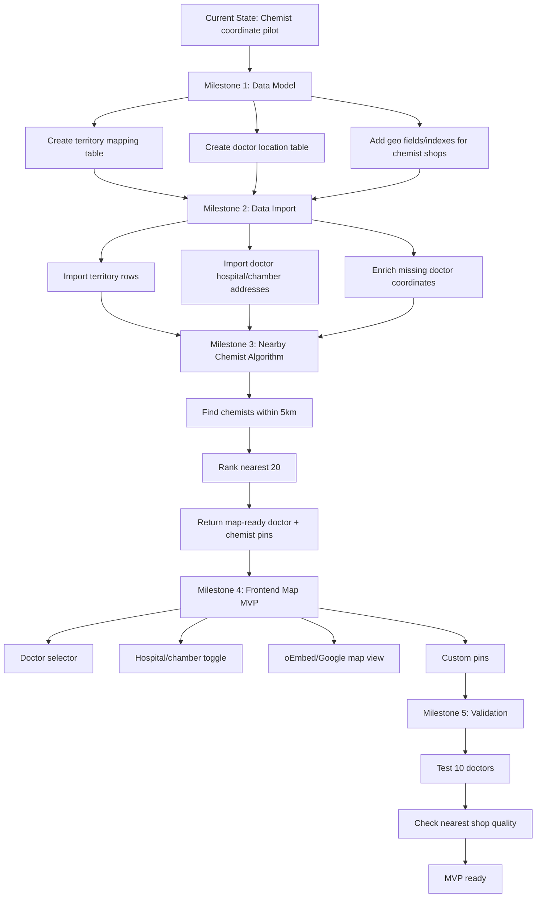

# MVP Milestones

```mermaid
flowchart TD
  A["Current State: Chemist coordinate pilot"] --> B["Milestone 1: Data Model"]
  B --> C["Create territory mapping table"]
  B --> D["Create doctor location table"]
  B --> E["Add geo fields/indexes for chemist shops"]

  C --> F["Milestone 2: Data Import"]
  D --> F
  E --> F

  F --> G["Import territory rows"]
  F --> H["Import doctor hospital/chamber addresses"]
  F --> I["Enrich missing doctor coordinates"]

  G --> J["Milestone 3: Nearby Chemist Algorithm"]
  H --> J
  I --> J

  J --> K["Find chemists within 5km"]
  K --> L["Rank nearest 20"]
  L --> M["Return map-ready doctor + chemist pins"]

  M --> N["Milestone 4: Frontend Map MVP"]
  N --> O["Doctor selector"]
  N --> P["Hospital/chamber toggle"]
  N --> Q["oEmbed/Google map view"]
  N --> R["Custom pins"]

  R --> S["Milestone 5: Validation"]
  S --> T["Test 10 doctors"]
  T --> U["Check nearest shop quality"]
  U --> V["MVP ready"]
```
