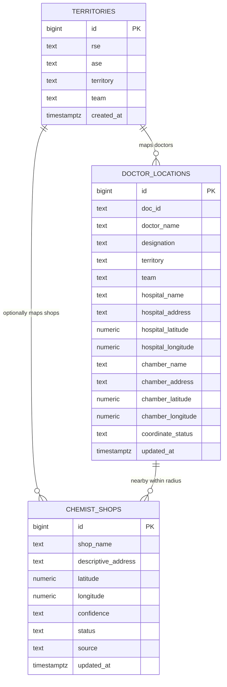

# Data Model

```mermaid
erDiagram
  TERRITORIES {
    bigint id PK
    text rse
    text ase
    text territory
    text team
    timestamptz created_at
  }

  DOCTOR_LOCATIONS {
    bigint id PK
    text doc_id
    text doctor_name
    text designation
    text territory
    text team
    text hospital_name
    text hospital_address
    numeric hospital_latitude
    numeric hospital_longitude
    text chamber_name
    text chamber_address
    numeric chamber_latitude
    numeric chamber_longitude
    text coordinate_status
    timestamptz updated_at
  }

  CHEMIST_SHOPS {
    bigint id PK
    text shop_name
    text descriptive_address
    numeric latitude
    numeric longitude
    text confidence
    text status
    text source
    timestamptz updated_at
  }

  TERRITORIES ||--o{ DOCTOR_LOCATIONS : "maps doctors"
  TERRITORIES ||--o{ CHEMIST_SHOPS : "optionally maps shops"
  DOCTOR_LOCATIONS ||--o{ CHEMIST_SHOPS : "nearby within radius"
```
