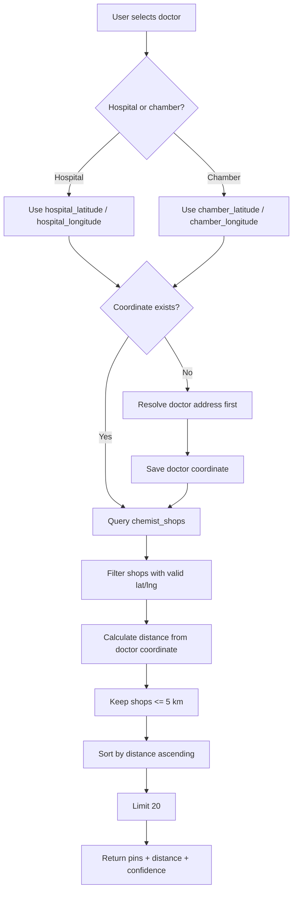

# Nearby Chemist Algorithm

```mermaid
flowchart TD
  A["User selects doctor"] --> B{"Hospital or chamber?"}
  B -->|Hospital| C["Use hospital_latitude / hospital_longitude"]
  B -->|Chamber| D["Use chamber_latitude / chamber_longitude"]

  C --> E{"Coordinate exists?"}
  D --> E

  E -->|No| F["Resolve doctor address first"]
  F --> G["Save doctor coordinate"]
  E -->|Yes| H["Query chemist_shops"]

  G --> H

  H --> I["Filter shops with valid lat/lng"]
  I --> J["Calculate distance from doctor coordinate"]
  J --> K["Keep shops <= 5 km"]
  K --> L["Sort by distance ascending"]
  L --> M["Limit 20"]
  M --> N["Return pins + distance + confidence"]
```
