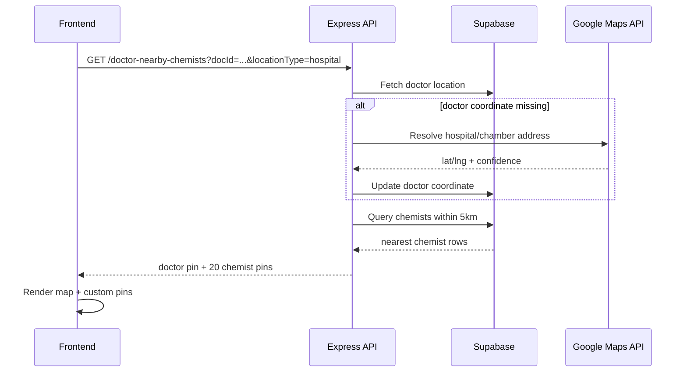

# Backend Endpoint Sequence

```mermaid
sequenceDiagram
  participant UI as Frontend
  participant API as Express API
  participant DB as Supabase
  participant Maps as Google Maps API

  UI->>API: GET /doctor-nearby-chemists?docId=...&locationType=hospital
  API->>DB: Fetch doctor location
  alt doctor coordinate missing
    API->>Maps: Resolve hospital/chamber address
    Maps-->>API: lat/lng + confidence
    API->>DB: Update doctor coordinate
  end
  API->>DB: Query chemists within 5km
  DB-->>API: nearest chemist rows
  API-->>UI: doctor pin + 20 chemist pins
  UI->>UI: Render map + custom pins
```
