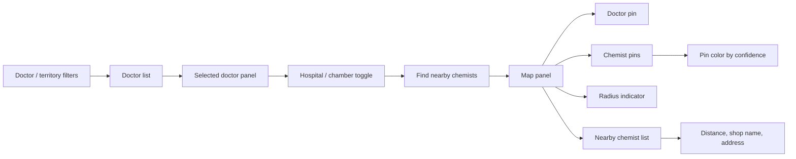

# Frontend MVP

```mermaid
flowchart LR
  A["Doctor / territory filters"] --> B["Doctor list"]
  B --> C["Selected doctor panel"]
  C --> D["Hospital / chamber toggle"]
  D --> E["Find nearby chemists"]
  E --> F["Map panel"]

  F --> G["Doctor pin"]
  F --> H["Chemist pins"]
  F --> I["Radius indicator"]
  F --> J["Nearby chemist list"]

  H --> K["Pin color by confidence"]
  J --> L["Distance, shop name, address"]
```
