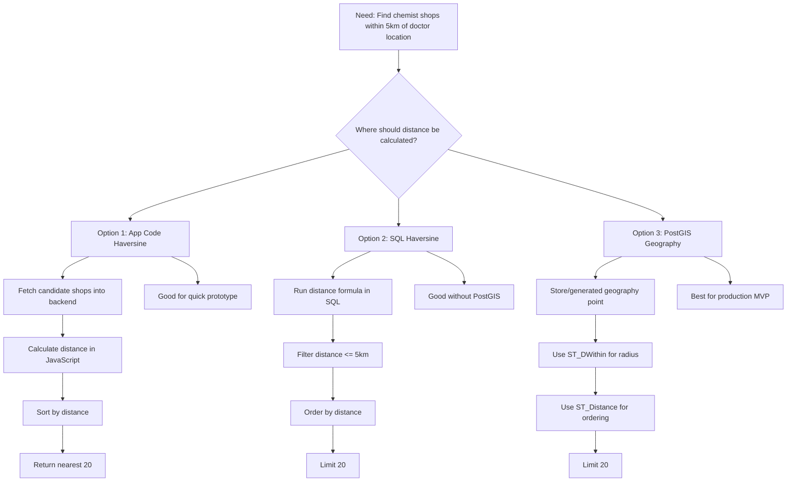

# Distance Algorithm Choices

```mermaid
flowchart TD
  A["Need: Find chemist shops within 5km of doctor location"] --> B{"Where should distance be calculated?"}

  B --> C["Option 1: App Code Haversine"]
  B --> D["Option 2: SQL Haversine"]
  B --> E["Option 3: PostGIS Geography"]

  C --> C1["Fetch candidate shops into backend"]
  C1 --> C2["Calculate distance in JavaScript"]
  C2 --> C3["Sort by distance"]
  C3 --> C4["Return nearest 20"]

  D --> D1["Run distance formula in SQL"]
  D1 --> D2["Filter distance <= 5km"]
  D2 --> D3["Order by distance"]
  D3 --> D4["Limit 20"]

  E --> E1["Store/generated geography point"]
  E1 --> E2["Use ST_DWithin for radius"]
  E2 --> E3["Use ST_Distance for ordering"]
  E3 --> E4["Limit 20"]

  C --> C5["Good for quick prototype"]
  D --> D5["Good without PostGIS"]
  E --> E5["Best for production MVP"]
```
