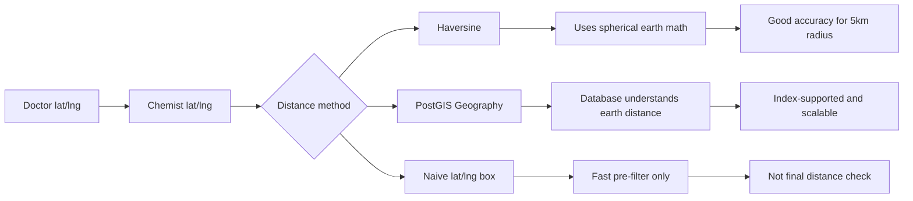

# Distance Method Comparison

```mermaid
flowchart LR
  A["Doctor lat/lng"] --> B["Chemist lat/lng"]
  B --> C{"Distance method"}

  C --> D["Haversine"]
  D --> D1["Uses spherical earth math"]
  D1 --> D2["Good accuracy for 5km radius"]

  C --> E["PostGIS Geography"]
  E --> E1["Database understands earth distance"]
  E1 --> E2["Index-supported and scalable"]

  C --> F["Naive lat/lng box"]
  F --> F1["Fast pre-filter only"]
  F1 --> F2["Not final distance check"]
```
