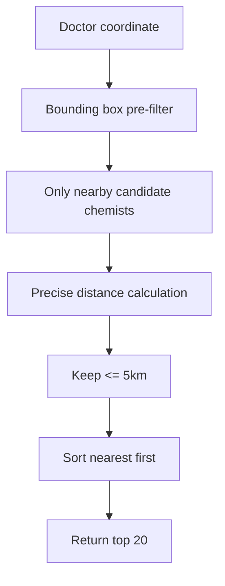

# Recommended Hybrid Distance Flow

```mermaid
flowchart TD
  A["Doctor coordinate"] --> B["Bounding box pre-filter"]
  B --> C["Only nearby candidate chemists"]
  C --> D["Precise distance calculation"]
  D --> E["Keep <= 5km"]
  E --> F["Sort nearest first"]
  F --> G["Return top 20"]
```
