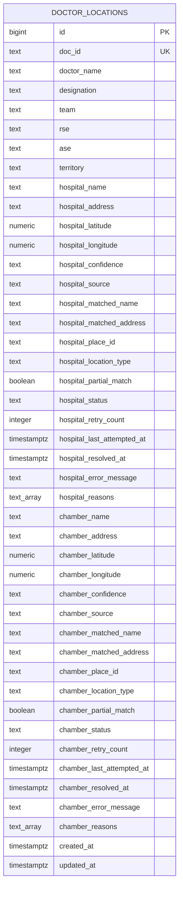

# Doctor Hospital And Chamber Location Data Model

This table treats hospital and chamber as two independent coordinate targets for the same doctor.

That means one doctor can have:

- a resolved hospital coordinate and a pending chamber coordinate
- a low-confidence chamber coordinate and a high-confidence hospital coordinate
- separate retry counts, errors, matched addresses, and source metadata

