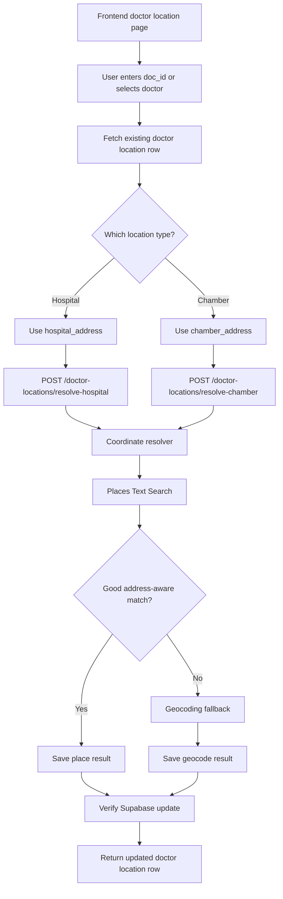

# Doctor Location Endpoint Plan



Proposed endpoints:

```txt
GET  /doctor-locations/:docId
POST /doctor-locations/upsert
POST /doctor-locations/resolve-hospital
POST /doctor-locations/resolve-chamber
GET  /doctor-locations/enrichment-status
POST /doctor-locations/process-next
```

The resolver can reuse the existing pharmacy coordinate logic, but pass the hospital/chamber address and a stronger query label such as:

```txt
{hospital_name}, {hospital_address}, Bangladesh
{chamber_name}, {chamber_address}, Bangladesh
Dr. {doctor_name}, {chamber_address}, Bangladesh
```

