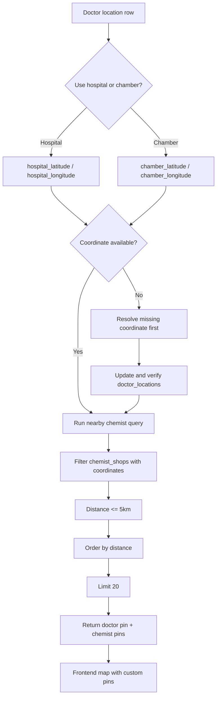

# Doctor To Nearby Chemist Radius Flow

```mermaid
flowchart TD
  A["Doctor location row"] --> B{"Use hospital or chamber?"}
  B -->|Hospital| C["hospital_latitude / hospital_longitude"]
  B -->|Chamber| D["chamber_latitude / chamber_longitude"]

  C --> E{"Coordinate available?"}
  D --> E

  E -->|No| F["Resolve missing coordinate first"]
  F --> G["Update and verify doctor_locations"]
  E -->|Yes| H["Run nearby chemist query"]
  G --> H

  H --> I["Filter chemist_shops with coordinates"]
  I --> J["Distance <= 5km"]
  J --> K["Order by distance"]
  K --> L["Limit 20"]
  L --> M["Return doctor pin + chemist pins"]
  M --> N["Frontend map with custom pins"]
```

